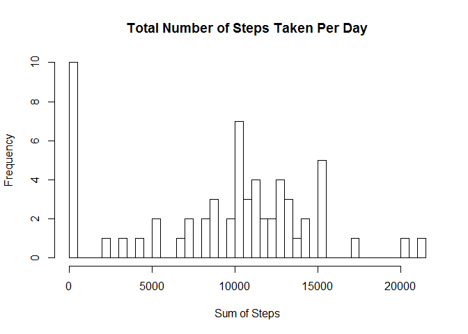
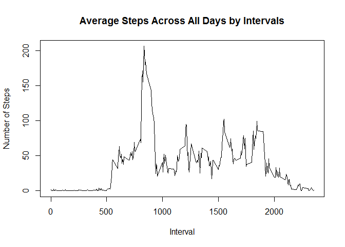
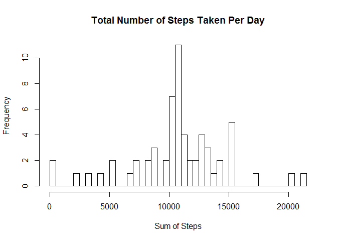
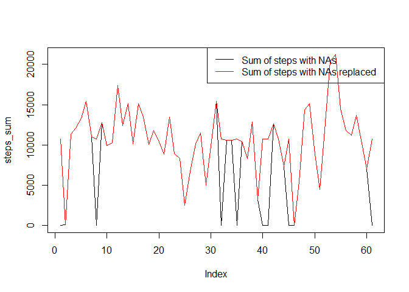
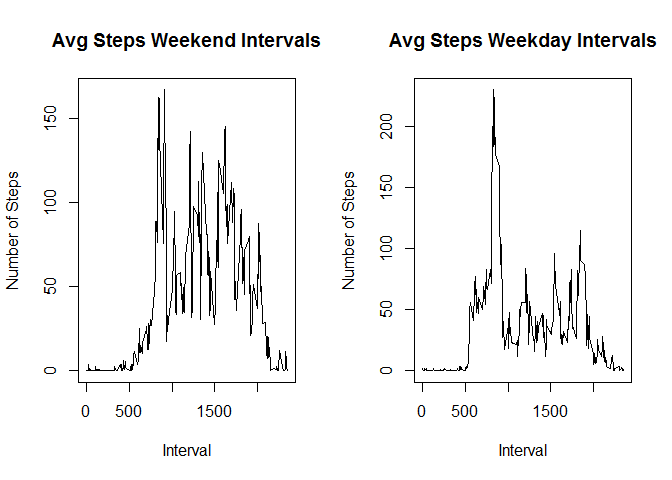

# Reproducible Research: Peer Assignment 1
JoeBooksLevy  
Friday, May 15, 2015  

##Loading and pre-processing the data


```r
##Load/read activity data file
activity<-read.csv("activity.csv")

##Set variables to work with data set
steps<-activity$steps
date<-activity$date
interval<-activity$interval

##Adjust the intervals to be easier to work with
new_interval<-format(interval, format="%H%M")
```


##What is mean total number of steps taken per day?


```r
##Calculate total number of steps per day with any NA step values removed
steps_sum<-tapply(steps, date, sum, na.rm=TRUE)

##Plot histogram of steps per day (breaks of 61 for unique days)
hist(steps_sum, breaks=61, main="Total Number of Steps Taken Per Day", 
     xlab="Sum of Steps")
```

 

```r
##Calculate and print mean of total number of steps per day
avg_stepsum<-mean(steps_sum)

##Calculate and print median of total number of steps per day
med_stepsum<-median(steps_sum)
```

###Calculate and report the mean and median total number of steps taken per day

Aside from looking at the histogram of steps per day, the mean total number of
steps per day is 9354.2295082 and the median total number of steps per day is
10395.


##What is the average daily activity pattern?


```r
##Create variable of average number of steps taken averaged across all days
steps_days<-aggregate(steps~new_interval, FUN=mean, na.rm=TRUE)

##Print a time series plot of the 5-minute interval (x-axis) and the average
##number of steps taken, averaged across all days (y-axis)
plot(steps_days, type="l", main="Average Steps Across All Days by Intervals", 
     xlab="Interval", ylab="Number of Steps")
```

 

###Which 5-minute interval, on average across all the days in the dataset, contains the maximum number of steps?


```r
##Using max to identify maximum number of steps from the averaged dataset
max(steps_days$steps, na.rm=TRUE) 
```

```
## [1] 206.1698
```

```r
##Using the max step value to identify the row in data set where this occurs
which(grepl(206.1698, steps_days$steps))
```

```
## [1] 104
```

```r
##Using row to identify the interval (0835) on average across all days in 
##dataset with maximum number of steps.
max_interval<-steps_days[104, ]
max_interval$new_interval
```

```
## [1] " 835"
```

Using the code above, you can see the 5-minute interval on average across all 
the days in dataset with the maximum number of steps is  835.


##Imputting missing values

So far, the NAs values have been removed from calculations. Moving forward, we 
want to replace them with average number of steps per interval. The code below 
shows how we do this and creates a new dataset equal to the original dataset but
with the missing data filled in.


```r
##Calculate and report the total number of missing values in the dataset (i.e. 
##the total number of rows with NAs)
sum(is.na(activity))
```

```
## [1] 2304
```

```r
##Get average number of steps per interval to use to replace NA values
steps_avg<-tapply(steps, interval, mean, na.rm=TRUE)

##Set average number of steps per interval as a matrix and use these average 
##values to use data to replace NA values in the dataset
matrix_steps<-as.matrix(steps_avg)
na_replace<-matrix_steps[,1]

##Create new dataset equal to the original dataset but with missing data (NAs) 
##filled in with new data (average number of steps per interval).
activity_copy<-activity
activity_copy[is.na(activity_copy)]<-na_replace
```

###Make a histogram of the total number of steps taken each day.


```r
##Set variables of new dataset to be easier to work with
steps2<-activity_copy$steps
date2<-activity_copy$date
interval2<-activity_copy$interval

##Calculate sum of steps per day with NA step values removed
steps_sum2<-tapply(steps2, date2, sum)

##Plot histogram of steps per day (breaks of 61 for unique days)
hist(steps_sum2, breaks=61, main="Total Number of Steps Taken Per Day", 
     xlab="Sum of Steps")
```

 

```r
##Calculate and print mean of total number of steps per day
avg_stepsum2<-mean(steps_sum2)
avg_stepsum2
```

```
## [1] 10766.19
```

```r
##Calculate and print median of total number of steps per day
med_stepsum2<-median(steps_sum2)
med_stepsum2
```

```
## [1] 10766.19
```

###Calculate and report the mean and median total number of steps taken per day

Aside from looking at the histogram of steps per day with the dataset with 
filled in values, the mean total number of steps per day from this dataset is 
1.0766189\times 10^{4} and the median total number of steps per day from this dataset 
is 1.0766189\times 10^{4}.

###Do these values differ from the estimates from the first part of the assignment? 
The values indeed differed. Again, the mean total number of steps per day from 
the dataset with filled in values is 1.0766189\times 10^{4}, the median is 1.0766189\times 10^{4}. 
In comparison with mean and median when NA values were ignored but not replaced,
the mean was 9354.2295082 and the median was 10395.

###What is the impact of imputing missing data on the estimates of the total daily number of steps?


```r
##Plot total daily number of steps with NAs and total number with NAs replaced
plot(steps_sum, type="l", col="black")
lines(steps_sum2, col="red")

##Create legend for plot
legend("topright", legend=c("Sum of steps with NAs","Sum of steps with NAs replaced"), 
       col=c("black", "red"), lwd=1)
```

 

The plot image has both data sets plotted in the same space - the black line is
the sum of steps with NAs (from the original dataset) and the red line is the
sum of steps with NAs replaced with values. Both plot lines are nearly identical
except for the sharp drops in number of steps of the dataset with NAs. Replacing
the NA values not only changed the mean and median, but it also brought the 
values closer together than they were before.


##Are there differences in activity patterns between weekdays and weekends?

###Create a new factor variable in the data set with two levels - "weekday" and "weekend" indicating whether a given date is a weekday or weekend day.


```r
##Using dataset with filled-in values for NAs, create a new column listing 
##the day of the week for each date.  
activity_copy$weekday<-weekdays(as.Date(activity_copy$date))

##Create new factor variable indicating whether date is a weekday or weekend day
activity_copy$day_or_end<-weekdays(as.Date(activity_copy$date))
for (x in 1:nrow(activity_copy)){
  if(activity_copy[x,]$day_or_end %in% c("Saturday", "Sunday")){
    activity_copy[x,]$day_or_end<-"Weekend"
  }
  else{
    activity_copy[x,]$day_or_end<-"Weekday"
  }
}
```

The new factor variable in the dataset is called "day_or_end".

###Make a panel plot containing a time series plot (i.e. type = "l") of the 5-minute interval (x-axis) and the average number of steps taken, averaged across all weekday days or weekend days (y-axis).


```r
##Adjust the intervals to be easier to work with
new_interval2<-format(interval2, format="%H%M")

##Create variable of average number of steps taken averaged across all days
steps_days2<-aggregate(steps2~new_interval2, FUN=mean, na.rm=TRUE)

##Create separate data sets - one of weekend data and one of weekday data
ends<-activity_copy[which(activity_copy$day_or_end=="Weekend"), ]
days<-activity_copy[which(activity_copy$day_or_end=="Weekday"), ]

##Adjust the intervals to be easier to work with in each data set
ends_interval<-format(ends$interval, format="%H%M")
days_interval<-format(days$interval, format="%H%M")

##Create variable of average number of steps taken averaged across days in each
##data set
ends_steps<-aggregate(ends$steps~ends_interval, FUN=mean, na.rm=TRUE)
days_steps<-aggregate(days$steps~days_interval, FUN=mean, na.rm=TRUE)

##Set up plot area for two panels
par(mfrow=c(1,2))

##Plot average steps on weekend days by intervals
plot(ends_steps, type="l", main="Avg Steps Weekend Intervals", 
     xlab="Interval", ylab="Number of Steps")

##Plot average steps on weekday days by intervals
plot(days_steps, type="l", main="Avg Steps Weekday Intervals", 
     xlab="Interval", ylab="Number of Steps")
```

 
